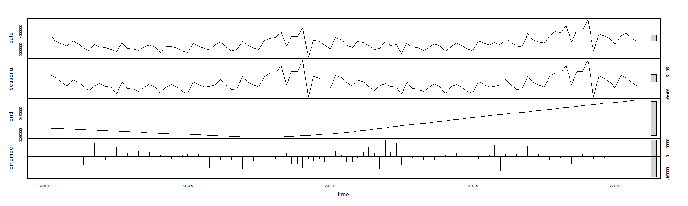

Title
========================================================

This is an R Markdown document. Markdown is a simple formatting syntax for authoring web pages (click the **Help** toolbar button for more details on using R Markdown).

When you click the **Knit HTML** button a web page will be generated that includes both content as well as the output of any embedded R code chunks within the document. You can embed an R code chunk like this:

**Objective**:

Framework:
input -> model -> output
1. Context.Domain: Walmart sales. (Retail, lower income group, Arkansas hq, weekly sales revenue)

1. Work backwards. What is the output?

2. Output: 9 months of weekly sales (revenue, not inventory, assume price is consistent). Granularity: week

3. Model:

3a.  What are the simplifying equations: What is it made of? What would drive it? Think of the who? Who is the user? Who is the decision maker? In this case, the user is the grocery shopper...

3b.  Week seasonality: Pay periods vs non pay periods (bi-weekly, pay check to pay check). Food stamps.

3c.  Month seasonality: Based on seasons, winter vs summer (some products are weather sensitive)

3d.  Holiday seasonaity: Type of holiday( xmas vs superbowl), holiday occuring on weekday vs a weekend

3e.  External factors: Promo effects

3f.  Trends: Grow customer base ( more shops, more customer base - from unemployed, other retailers). Grow engagement ( more spend from current customers - promos) 


Prediction:

1.Dependent variable : Weekly Sales (Assuming in dollars)>>> Continuous (vs Categorical) >> Regression

2 How far in the future: Given 2.5 years predict 9 months from 2012 Nov to 2013 July

3. Overall goal: 9 months into the future. This seems like a long time.

4. Given 2.5 years of data....what is the smallest unit that we can predict here...say given what we have could we predict the last month? If we can then that would give us some confidence of the next month.

5. Reduce it to the lowest common unit

3.Equation: Prior priors -> 1 to 9 Months ahead

4.Granularity: Across diff stores, across diff dept at the weekly level

Training/Testing:
1. Training - we are given 2.5 years of history. Starting with 2010 - 2012. 2012 is when the markdowns were impl.
2. This means baseline of 2010-2011 = baseline and then 2012 = markdowns effect
3. Holidays are given more points
4. Training can we partition 2012 into two parts or 4 holidays we split 2 - 2. Can we generalize across holidays are do we have to see the effect for each to extrapolate to the following year? Possibly each markdown would have a diff impact on holiday.
5. Maybe what we can do is markdown impact on non-holiday vs holiday
6. Typically recency is a good indicator
7. trick is the following:
7a: 2011 predicts 2011


```r
summary(cars)
```

```
##      speed           dist       
##  Min.   : 4.0   Min.   :  2.00  
##  1st Qu.:12.0   1st Qu.: 26.00  
##  Median :15.0   Median : 36.00  
##  Mean   :15.4   Mean   : 42.98  
##  3rd Qu.:19.0   3rd Qu.: 56.00  
##  Max.   :25.0   Max.   :120.00
```

You can also embed plots, for example:


```r
plot(cars)
```

 

like the idea of calling it a sample, meaning that it's not the full population so we want to intepret abt the population

```r
sample<-read.csv('C:/Users/dwoo57/Google Drive/Career/Data Mining Competitions/Kaggle/Walmart - Inventory and weather prediction/Experiments/Gamma/Exp_A/Dept92_All_stores.csv')
sample$Date<-as.Date(sample$Date,"%m/%d/%Y")
str(sample)
```

```
## 'data.frame':	6435 obs. of  19 variables:
##  $ Store       : int  1 1 1 1 1 1 1 1 1 1 ...
##  $ Dept        : int  92 92 92 92 92 92 92 92 92 92 ...
##  $ Date        : Date, format: "2010-02-05" "2010-02-12" ...
##  $ Weekly_Sales: num  139885 143081 135067 125048 132945 ...
##  $ IsHoliday   : logi  FALSE TRUE FALSE FALSE FALSE FALSE ...
##  $ Year        : int  2010 2010 2010 2010 2010 2010 2010 2010 2010 2010 ...
##  $ Month       : int  2 2 2 2 3 3 3 3 4 4 ...
##  $ Weeknum     : int  6 7 8 9 10 11 12 13 14 15 ...
##  $ Key         : int  140214 140221 140228 140235 140242 140249 140256 140263 140270 140277 ...
##  $ Temperature : num  42.3 38.5 39.9 46.6 46.5 ...
##  $ Fuel_Price  : num  2.57 2.55 2.51 2.56 2.62 ...
##  $ MarkDown1   : num  NA NA NA NA NA NA NA NA NA NA ...
##  $ MarkDown2   : num  NA NA NA NA NA NA NA NA NA NA ...
##  $ MarkDown3   : num  NA NA NA NA NA NA NA NA NA NA ...
##  $ MarkDown4   : num  NA NA NA NA NA NA NA NA NA NA ...
##  $ MarkDown5   : num  NA NA NA NA NA NA NA NA NA NA ...
##  $ CPI         : num  211 211 211 211 211 ...
##  $ Unemployment: num  8.11 8.11 8.11 8.11 8.11 ...
##  $ Store_type  : Factor w/ 3 levels "A","B","C": 1 1 1 1 1 1 1 1 1 1 ...
```

```r
sample2<-read.csv('C:/Users/dwoo57/Google Drive/Career/Data Mining Competitions/Kaggle/Walmart - Inventory and weather prediction/Experiments/Gamma/Exp_A/Dept92_All_stores_V2.csv')
sample2$Date<-as.Date(sample2$Date,"%m/%d/%Y")
str(sample2)
```

```
## 'data.frame':	6435 obs. of  20 variables:
##  $ Store       : int  1 1 1 1 1 1 1 1 1 1 ...
##  $ Dept        : int  92 92 92 92 92 92 92 92 92 92 ...
##  $ Date        : Date, format: "2010-02-05" "2010-02-12" ...
##  $ Weekly_Sales: num  139885 143081 135067 125048 132945 ...
##  $ IsHoliday   : logi  FALSE TRUE FALSE FALSE FALSE FALSE ...
##  $ Year        : int  2010 2010 2010 2010 2010 2010 2010 2010 2010 2010 ...
##  $ Month       : int  2 2 2 2 3 3 3 3 4 4 ...
##  $ Weeknum     : int  6 7 8 9 10 11 12 13 14 15 ...
##  $ Weeknum_mod : int  5 6 7 8 9 10 11 12 13 14 ...
##  $ Key         : int  140214 140221 140228 140235 140242 140249 140256 140263 140270 140277 ...
##  $ Temperature : num  42.3 38.5 39.9 46.6 46.5 ...
##  $ Fuel_Price  : num  2.57 2.55 2.51 2.56 2.62 ...
##  $ MarkDown1   : num  NA NA NA NA NA NA NA NA NA NA ...
##  $ MarkDown2   : num  NA NA NA NA NA NA NA NA NA NA ...
##  $ MarkDown3   : num  NA NA NA NA NA NA NA NA NA NA ...
##  $ MarkDown4   : num  NA NA NA NA NA NA NA NA NA NA ...
##  $ MarkDown5   : num  NA NA NA NA NA NA NA NA NA NA ...
##  $ CPI         : num  211 211 211 211 211 ...
##  $ Unemployment: num  8.11 8.11 8.11 8.11 8.11 ...
##  $ Store_type  : Factor w/ 3 levels "A","B","C": 1 1 1 1 1 1 1 1 1 1 ...
```

knit may be abit slow for modeling etc. Good to have for documentation but may want to keep both codes open
Based on the below

```r
library(plyr)
library(lattice)  #xyplot
library(latticeExtra)  #layer_, panel.xblocks
```

```
## Error in library(latticeExtra): there is no package called 'latticeExtra'
```

```r
library(gridExtra)  #grid.arrange
```

```
## Error in library(gridExtra): there is no package called 'gridExtra'
```

```r
library(RColorBrewer)  #brewer.pal
library(ggplot2)

sample.new<-ddply(sample, .(Date,Weeknum,Year,IsHoliday),summarise,Weekly_Sales = sum(Weekly_Sales))
str(sample.new)
```

```
## 'data.frame':	143 obs. of  5 variables:
##  $ Date        : Date, format: "2010-02-05" "2010-02-12" ...
##  $ Weeknum     : int  6 7 8 9 10 11 12 13 14 15 ...
##  $ Year        : int  2010 2010 2010 2010 2010 2010 2010 2010 2010 2010 ...
##  $ IsHoliday   : logi  FALSE TRUE FALSE FALSE FALSE FALSE ...
##  $ Weekly_Sales: num  3781163 3443837 3312992 3204210 3480725 ...
```

```r
ddply(sample, .(Year),summarise,Weekly_Sales = sum(Weekly_Sales))
```

```
##   Year Weekly_Sales
## 1 2010    155837576
## 2 2011    176476325
## 3 2012    151629441
```

```r
sample2.new<-ddply(sample2, .(Date,Weeknum_mod,Year,IsHoliday),summarise,Weekly_Sales = sum(Weekly_Sales))
str(sample.new)
```

```
## 'data.frame':	143 obs. of  5 variables:
##  $ Date        : Date, format: "2010-02-05" "2010-02-12" ...
##  $ Weeknum     : int  6 7 8 9 10 11 12 13 14 15 ...
##  $ Year        : int  2010 2010 2010 2010 2010 2010 2010 2010 2010 2010 ...
##  $ IsHoliday   : logi  FALSE TRUE FALSE FALSE FALSE FALSE ...
##  $ Weekly_Sales: num  3781163 3443837 3312992 3204210 3480725 ...
```

```r
ddply(sample2, .(Year),summarise,Weekly_Sales = sum(Weekly_Sales))
```

```
##   Year Weekly_Sales
## 1 2010    155837576
## 2 2011    176476325
## 3 2012    151629441
```

 From this figure, say we were to build a model for each year
 2010 = seasonality
 2011 = 2010_seasonality + 2011_Trend
 2012 = 2010_seasonality + 2011_Trend + 2012_Trend + Markdowns
 2013 = 2010_seasonality + 2011_Trend + 2012_Trend + 2013_Trend + Markdowns

From 2010 and 2011 we can possibly determine the seasonality and trend
We possibly can assume seasonality reminds the same
Do we assume the trend would repeat year on year? Thought earlier was whether there were explanatory variables that would explain the trend
Then once we know this we can then determine the impact of the markdowns

 sounds like a reasonable place to start
 train data is all
 test data is the submission data
 eventually want to have cross-validation set. Maybe partition 2012. Take some weeks out and see what happens, especially non holiday weeks 

```r
ggplot(sample.new, aes(Weeknum,Weekly_Sales)) + 
  geom_line( aes(colour = factor(Year) ),size = 1)  + 
  geom_point( aes(color = factor(IsHoliday)),size = 3.5)
```

 

Transformation:

1. Aligning the weeks for comparison. Why it matter? Seasonality is consistent year on year, even with promos.

2. So looks like next area is understanding the split. in 2011, 2nd half when it started splitting. 

2a.  Consider using average - want to generalize across stores. Also, when looking at stores can we group them. High level then low level


```r
ggplot(sample2.new, aes(Weeknum_mod,Weekly_Sales)) + 
  geom_line( aes(colour = factor(Year) ),size = 1)  + 
  geom_point( aes(color = factor(IsHoliday)),size = 3.5)
```

 
strategy
1.determine seasonality component
2.Trend component. 
3.Goal for train set is to predict 2012 and then the submission file is the test set.

How does STL predict the trend?
Probably what i would do is
 use 2010 to predict 2011 once i have this stable then predict 2012. then use this has a baseline
 if i use 2010 to predict 2011. Would i over predict?
 


```r
library(forecast)
```

```
## Loading required package: zoo
## 
## Attaching package: 'zoo'
## 
## The following objects are masked from 'package:base':
## 
##     as.Date, as.Date.numeric
## 
## Loading required package: timeDate
## This is forecast 5.9
```

```r
sample.new.subset<-subset(sample.new, Date >= "2010-01-01" & Date <= "2012-02-28")
train_ts<- ts(sample.new.subset$Weekly_Sales, frequency=52, start = c(2010, 2,5))
fit1 <- stl(train_ts,  s.window="periodic", t.window = 52)
plot(fit1)
```

 

```r
summary(fit1)
```

```
##  Call:
##  stl(x = train_ts, s.window = "periodic", t.window = 52)
## 
##  Time.series components:
##     seasonal             trend           remainder         
##  Min.   :-603190.0   Min.   :3229339   Min.   :-179372.71  
##  1st Qu.:-166923.1   1st Qu.:3260171   1st Qu.: -32044.21  
##  Median : -65736.5   Median :3303609   Median :  -2951.49  
##  Mean   :   4954.4   Mean   :3346866   Mean   :  -3568.91  
##  3rd Qu.: 190421.8   3rd Qu.:3431744   3rd Qu.:  26496.53  
##  Max.   :1057021.8   Max.   :3579803   Max.   : 141250.86  
##  IQR:
##      STL.seasonal STL.trend STL.remainder data  
##      357345       171573     58541        378712
##    %  94.4         45.3      15.5         100.0 
## 
##  Weights: all == 1
## 
##  Other components: List of 5
##  $ win  : Named num [1:3] 1081 52 53
##  $ deg  : Named int [1:3] 0 1 1
##  $ jump : Named num [1:3] 109 6 6
##  $ inner: int 2
##  $ outer: int 0
```

```r
accuracy(forecast(fit1))
```

```
##                    ME     RMSE      MAE       MPE     MAPE      MASE
## Training set 6600.977 59193.98 44644.48 0.1669985 1.344385 0.2263082
##                    ACF1
## Training set -0.1606161
```

MAPE of 1.3% that seems low. Could potentially be overfitting.
Some take aways:
Looking at 2011. Also for accuracy what sample does it use? Uses in sample so all.
If look at the trend see that this is almost a linear curve, does this make sense? Why would consumption increase linearly over time?
How about remainder? Some assumptions, error should be random, meaning no correlation between points.
Maybe can include some diagnostic plots here.
Seems random
Not increasing over time

Maybe seasonality is really multiplicative, seems odd the trend would increase linearly over time. Should be step wise
When to use additive vs multiplicative. Mainly does the seasonal component vary with time or volume? 
I think mainly of seasonal component is constant or does it vary with the 'volume' or varies with the actual trend.
Is it a trend * seasonality or trend + seasonality. if varies with the trend that is multiplicative
Maybe a framework is thinking of it in mathematical formulas there are only a few permulations
x +-*/ y then (y * y ...) + z Only these variations

So now, we have framework for decomposing into seasonality + trend
We have a notebook that would help us rehash and formulate the analysis
Next, we are looking into the predictability or how generalizable is this model.

Generalizability:
Seasonality i think make sense
Just the trend is odd. Why would it increase linearly over time.
Unless population grows that rapidly?

Can we check unemployment rate?

**Transformations that helped**:
1. Offseting the time series helps - aligning the weeks


```r
library(forecast)
sample.new.subset<-subset(sample.new, Date >= "2010-01-01" & Date <= "2012-02-28")
train_ts<- ts(sample.new.subset$Weekly_Sales, frequency=52, start = c(2010, 2,5))
fit1 <- stl(train_ts,  s.window="periodic", t.window = 52)
plot(fit1)
```

 

```r
summary(fit1)
```

```
##  Call:
##  stl(x = train_ts, s.window = "periodic", t.window = 52)
## 
##  Time.series components:
##     seasonal             trend           remainder         
##  Min.   :-603190.0   Min.   :3229339   Min.   :-179372.71  
##  1st Qu.:-166923.1   1st Qu.:3260171   1st Qu.: -32044.21  
##  Median : -65736.5   Median :3303609   Median :  -2951.49  
##  Mean   :   4954.4   Mean   :3346866   Mean   :  -3568.91  
##  3rd Qu.: 190421.8   3rd Qu.:3431744   3rd Qu.:  26496.53  
##  Max.   :1057021.8   Max.   :3579803   Max.   : 141250.86  
##  IQR:
##      STL.seasonal STL.trend STL.remainder data  
##      357345       171573     58541        378712
##    %  94.4         45.3      15.5         100.0 
## 
##  Weights: all == 1
## 
##  Other components: List of 5
##  $ win  : Named num [1:3] 1081 52 53
##  $ deg  : Named int [1:3] 0 1 1
##  $ jump : Named num [1:3] 109 6 6
##  $ inner: int 2
##  $ outer: int 0
```

```r
accuracy(forecast(fit1))
```

```
##                    ME     RMSE      MAE       MPE     MAPE      MASE
## Training set 6600.977 59193.98 44644.48 0.1669985 1.344385 0.2263082
##                    ACF1
## Training set -0.1606161
```


Potential resources:
Computing baseline sales
http://www.tabsgroup.com/wp-content/uploads/2012/12/modeltoimprovetheestimationofbaselineretailsales.pdf
