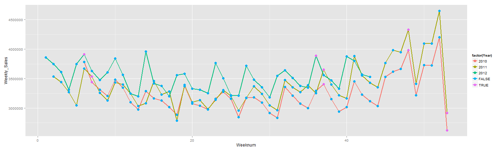
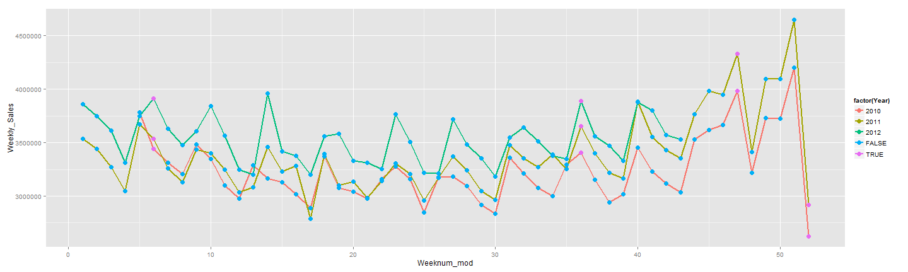

Title
========================================================

This is an R Markdown document. Markdown is a simple formatting syntax for authoring web pages (click the **Help** toolbar button for more details on using R Markdown).

When you click the **Knit HTML** button a web page will be generated that includes both content as well as the output of any embedded R code chunks within the document. You can embed an R code chunk like this:

**Objective**:

Framework:

A) eq: input -> model -> output

B) Reduce it to the lowest common unit

C) Ask why? Why is this important?

D) Generalization is a key concept. Random sampling....fewer + broad rules vs many + niche rules

1. Context.Domain: Walmart sales. (Retail, lower income group, Arkansas hq, weekly sales revenue)

1. Work backwards. What is the output?

2. Output: 9 months of weekly sales (revenue, not inventory, assume price is consistent). Granularity: week

3. Model:

3a.  What are the simplifying equations: What is it made of? What would drive it? Think of the who? Who is the user? Who is the decision maker? In this case, the user is the grocery shopper...

3b.  Week seasonality: Pay periods vs non pay periods (bi-weekly, pay check to pay check). Food stamps.

3c.  Month seasonality: Based on seasons, winter vs summer (some products are weather sensitive)

3d.  Holiday seasonaity: Type of holiday( xmas vs superbowl), holiday occuring on weekday vs a weekend

3e.  External factors: Promo effects

3f.  Trends: Grow customer base ( more shops, more customer base - from unemployed, other retailers). Grow engagement ( more spend from current customers - promos) 


**Exploration/Hypothesis Generation**:

1. Hypothesis: Seasonality + Trend = Sales

a) Seasonality is similar year on year as seen on the charts

b) Trend: 2011 ( 2nd half) -> 2010 + x , 2012 ( first half) -> 2010 + X. Is trend inc/dec/stop? What drives trend?


```r
summary(cars)
```

```
##      speed           dist       
##  Min.   : 4.0   Min.   :  2.00  
##  1st Qu.:12.0   1st Qu.: 26.00  
##  Median :15.0   Median : 36.00  
##  Mean   :15.4   Mean   : 42.98  
##  3rd Qu.:19.0   3rd Qu.: 56.00  
##  Max.   :25.0   Max.   :120.00
```

You can also embed plots, for example:


```r
plot(cars)
```

 

like the idea of calling it a sample, meaning that it's not the full population so we want to intepret abt the population

```r
sample<-read.csv('C:/Users/dwoo57/Google Drive/Career/Data Mining Competitions/Kaggle/Walmart - Inventory and weather prediction/Experiments/Gamma/Exp_A/Dept92_All_stores.csv')
sample$Date<-as.Date(sample$Date,"%m/%d/%Y")
str(sample)
```

```
## 'data.frame':	6435 obs. of  19 variables:
##  $ Store       : int  1 1 1 1 1 1 1 1 1 1 ...
##  $ Dept        : int  92 92 92 92 92 92 92 92 92 92 ...
##  $ Date        : Date, format: "2010-02-05" "2010-02-12" ...
##  $ Weekly_Sales: num  139885 143081 135067 125048 132945 ...
##  $ IsHoliday   : logi  FALSE TRUE FALSE FALSE FALSE FALSE ...
##  $ Year        : int  2010 2010 2010 2010 2010 2010 2010 2010 2010 2010 ...
##  $ Month       : int  2 2 2 2 3 3 3 3 4 4 ...
##  $ Weeknum     : int  6 7 8 9 10 11 12 13 14 15 ...
##  $ Key         : int  140214 140221 140228 140235 140242 140249 140256 140263 140270 140277 ...
##  $ Temperature : num  42.3 38.5 39.9 46.6 46.5 ...
##  $ Fuel_Price  : num  2.57 2.55 2.51 2.56 2.62 ...
##  $ MarkDown1   : num  NA NA NA NA NA NA NA NA NA NA ...
##  $ MarkDown2   : num  NA NA NA NA NA NA NA NA NA NA ...
##  $ MarkDown3   : num  NA NA NA NA NA NA NA NA NA NA ...
##  $ MarkDown4   : num  NA NA NA NA NA NA NA NA NA NA ...
##  $ MarkDown5   : num  NA NA NA NA NA NA NA NA NA NA ...
##  $ CPI         : num  211 211 211 211 211 ...
##  $ Unemployment: num  8.11 8.11 8.11 8.11 8.11 ...
##  $ Store_type  : Factor w/ 3 levels "A","B","C": 1 1 1 1 1 1 1 1 1 1 ...
```

```r
sample2<-read.csv('C:/Users/dwoo57/Google Drive/Career/Data Mining Competitions/Kaggle/Walmart - Inventory and weather prediction/Experiments/Gamma/Exp_A/Dept92_All_stores_V2.csv')
sample2$Date<-as.Date(sample2$Date,"%m/%d/%Y")
str(sample2)
```

```
## 'data.frame':	6435 obs. of  20 variables:
##  $ Store       : int  1 1 1 1 1 1 1 1 1 1 ...
##  $ Dept        : int  92 92 92 92 92 92 92 92 92 92 ...
##  $ Date        : Date, format: "2010-02-05" "2010-02-12" ...
##  $ Weekly_Sales: num  139885 143081 135067 125048 132945 ...
##  $ IsHoliday   : logi  FALSE TRUE FALSE FALSE FALSE FALSE ...
##  $ Year        : int  2010 2010 2010 2010 2010 2010 2010 2010 2010 2010 ...
##  $ Month       : int  2 2 2 2 3 3 3 3 4 4 ...
##  $ Weeknum     : int  6 7 8 9 10 11 12 13 14 15 ...
##  $ Weeknum_mod : int  5 6 7 8 9 10 11 12 13 14 ...
##  $ Key         : int  140214 140221 140228 140235 140242 140249 140256 140263 140270 140277 ...
##  $ Temperature : num  42.3 38.5 39.9 46.6 46.5 ...
##  $ Fuel_Price  : num  2.57 2.55 2.51 2.56 2.62 ...
##  $ MarkDown1   : num  NA NA NA NA NA NA NA NA NA NA ...
##  $ MarkDown2   : num  NA NA NA NA NA NA NA NA NA NA ...
##  $ MarkDown3   : num  NA NA NA NA NA NA NA NA NA NA ...
##  $ MarkDown4   : num  NA NA NA NA NA NA NA NA NA NA ...
##  $ MarkDown5   : num  NA NA NA NA NA NA NA NA NA NA ...
##  $ CPI         : num  211 211 211 211 211 ...
##  $ Unemployment: num  8.11 8.11 8.11 8.11 8.11 ...
##  $ Store_type  : Factor w/ 3 levels "A","B","C": 1 1 1 1 1 1 1 1 1 1 ...
```

knit may be abit slow for modeling etc. Good to have for documentation but may want to keep both codes open
Based on the below

```r
library(plyr)
library(lattice)  #xyplot
library(latticeExtra)  #layer_, panel.xblocks
```

```
## Error in library(latticeExtra): there is no package called 'latticeExtra'
```

```r
library(gridExtra)  #grid.arrange
```

```
## Error in library(gridExtra): there is no package called 'gridExtra'
```

```r
library(RColorBrewer)  #brewer.pal
library(ggplot2)

sample.new<-ddply(sample, .(Date,Weeknum,Year,IsHoliday),summarise,Weekly_Sales = sum(Weekly_Sales))
str(sample.new)
```

```
## 'data.frame':	143 obs. of  5 variables:
##  $ Date        : Date, format: "2010-02-05" "2010-02-12" ...
##  $ Weeknum     : int  6 7 8 9 10 11 12 13 14 15 ...
##  $ Year        : int  2010 2010 2010 2010 2010 2010 2010 2010 2010 2010 ...
##  $ IsHoliday   : logi  FALSE TRUE FALSE FALSE FALSE FALSE ...
##  $ Weekly_Sales: num  3781163 3443837 3312992 3204210 3480725 ...
```

```r
ddply(sample, .(Year),summarise,Weekly_Sales = sum(Weekly_Sales))
```

```
##   Year Weekly_Sales
## 1 2010    155837576
## 2 2011    176476325
## 3 2012    151629441
```

```r
sample2.new<-ddply(sample2, .(Date,Weeknum_mod,Year,IsHoliday),summarise,Weekly_Sales = sum(Weekly_Sales))
str(sample.new)
```

```
## 'data.frame':	143 obs. of  5 variables:
##  $ Date        : Date, format: "2010-02-05" "2010-02-12" ...
##  $ Weeknum     : int  6 7 8 9 10 11 12 13 14 15 ...
##  $ Year        : int  2010 2010 2010 2010 2010 2010 2010 2010 2010 2010 ...
##  $ IsHoliday   : logi  FALSE TRUE FALSE FALSE FALSE FALSE ...
##  $ Weekly_Sales: num  3781163 3443837 3312992 3204210 3480725 ...
```

```r
ddply(sample2, .(Year),summarise,Weekly_Sales = sum(Weekly_Sales))
```

```
##   Year Weekly_Sales
## 1 2010    155837576
## 2 2011    176476325
## 3 2012    151629441
```


```r
ggplot(sample.new, aes(Weeknum,Weekly_Sales)) + 
  geom_line( aes(colour = factor(Year) ),size = 1)  + 
  geom_point( aes(color = factor(IsHoliday)),size = 3.5)
```

 


Transformation:

1. Aligning the weeks for comparison. Why it matter? Seasonality is consistent year on year, even with promos.

2. So looks like next area is understanding the split. in 2011, 2nd half when it started splitting. 

2a.  Consider using average - want to generalize across stores. Also, when looking at stores can we group them. High level then low level


```r
ggplot(sample2.new, aes(Weeknum_mod,Weekly_Sales)) + 
  geom_line( aes(colour = factor(Year) ),size = 1)  + 
  geom_point( aes(color = factor(IsHoliday)),size = 3.5)
```

 


Thoughts:

1. In 2011, determine when the split ocurred - what are the external drivers? What causes this
2. Do we apply the same trend in 2012 for the first half?
3. Can we generalize across stores? High level grouping?

Next steps:
Q: Since trends are all increasing, what are explanatory variables that can explain it? i.e unemployment rate?

1. For store type A, take a random sample and plot difference year on year

a) Steps calculate year on year difference for the same store (done)
b) now take random sample of stores

str(sample2)

#First get a single store
sample2.store39<-subset(sample2, Store == 39)
str(sample2.store39)

#next how does the data look like
head(sample2.store39)
# need to match where year = year + 1 and weeknum = weeknum
install.packages("dplyr")
library(dplyr)

sample.tbl<-tbl_df(sample2.store39)

head(sample.tbl)
str(sample.tbl)
summary(sample.tbl)

sample.tbl %>
require(plyr)
library(quantmod)


subset.store39<-subset(sample2.store39, select =c('Date', 'Weekly_Sales','Weeknum_mod','Year'))
str(subset.store39)
ds_test$Store
#diff uses the consective arguments

#ddply(subset.store39, .(Weeknum_mod) , mutate, yoy = c(NA,diff(Weekly_Sales)/Weekly_Sales ))

ds<-ddply(subset.store39, .(Weeknum_mod) , transform, yoy_per = Delt(Weekly_Sales), yoy = c(NA,diff(Weekly_Sales)) )

ds<-subset(ds, Year ==2011)

plot(ds$Weeknum_mod,ds$Delt.1.arithmetic, type ='l')


b) Second part random sample

set.seed(1234)
take <- sample(unique(sample2$Store), 10)

NROW(unique(sample2$Store))
ncol(unique(sample2$Store))

take

ds_test<-sample2[sample2$Store %in% take, ]

summary(ds_test)
ds_test$Store<-as.factor(ds_test$Store)
NROW(unique(ds_test$Store))

c) now calculate diff 

ds<-ddply(ds_test, .(Store,Weeknum_mod) , transform, yoy_per = Delt(Weekly_Sales), yoy = c(NA,diff(Weekly_Sales)) )
ds<-subset(ds, Year ==2011)

str(ds)

#initial plot
#what is out goal here...take a sample to see what is going on.
#what are the questions we are interested? If they are all similar then should be similar to the average?
#do we then just say that type A has this trend?
#oh we wanted to understand what the drivers where, how they correlate to explanatory variables?

library(ggplot2)
ggplot(ds, aes(Weeknum_mod,Delt.1.arithmetic)) + 
  geom_line( aes(colour = factor(Store) ),size = 1)  + 
  geom_point(size = 2)

#These are the next steps
#very hard to see
#unless we smooth it out to see what is going on
#what is the monthly average


